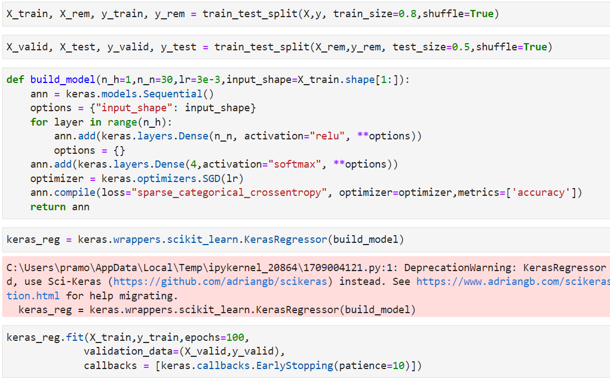
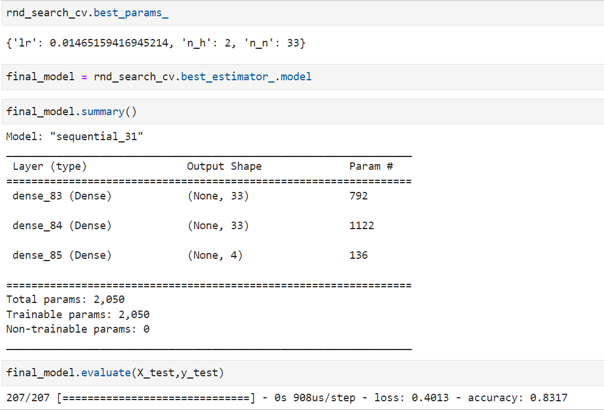
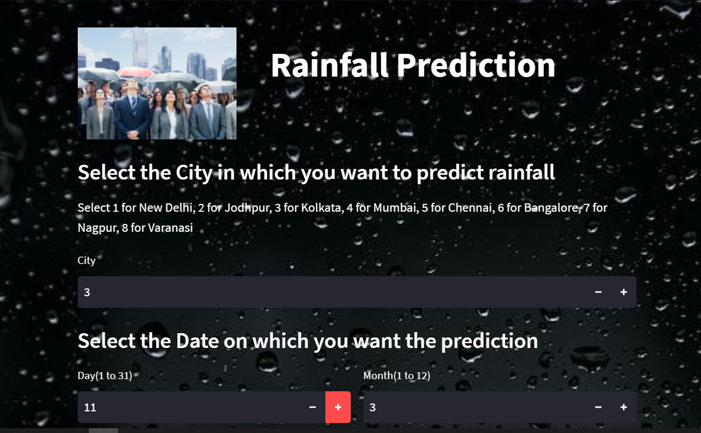
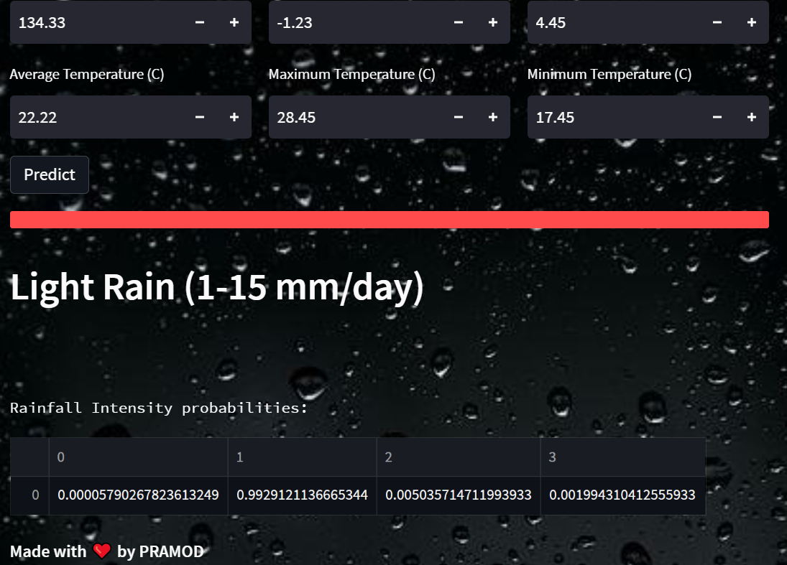

# Rainfall Prediction ML Web App
- ## Create Dataset
- Using Data from https://power.larc.nasa.gov/data-access-viewer/  download the precipitation datas of major cities into cvv file which will be the dataset
- Add city names and encode them using sklearn.preprocessing OneHotEncoder()
- Standardise the data using sklearn

- ## Training ANN model
- 

- Train the model using the data
- Check for best parameters using randomise cv
- Save the final model 

- ## Checking Model Prediction
-  Check model summary, parameters, loss and accuracy
- 
-  Test it manually on a single row

- ## Integrating into App
- Using streamlit make a web app and create input boxes for user input 
- After taking all inputs from user, combine the input data into a Dataframe and load the model
- Feed the input Dataframe to the model and get predictions for rainfall in form of probalities
- Process these probalities to out show an output Pediction on the App
### App Display

### Prediction

